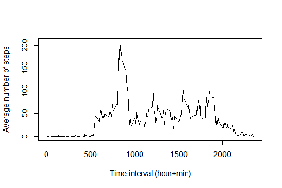

# Reproducible Research: Peer Assessment 1


## Loading and preprocessing the data

Check if the file exists and read the data from zip file:


```r
if(!file.exists("activity.zip")) {stop("File activity.zip not found")}
data <- read.table(unz("activity.zip", "activity.csv"), header=T, quote="\"", sep=",")
```

Quick look at data:


```r
head(data)
```

```
##   steps       date interval
## 1    NA 2012-10-01        0
## 2    NA 2012-10-01        5
## 3    NA 2012-10-01       10
## 4    NA 2012-10-01       15
## 5    NA 2012-10-01       20
## 6    NA 2012-10-01       25
```

Data summary:


```r
summary(data)
```

```
##      steps                date          interval     
##  Min.   :  0.00   2012-10-01:  288   Min.   :   0.0  
##  1st Qu.:  0.00   2012-10-02:  288   1st Qu.: 588.8  
##  Median :  0.00   2012-10-03:  288   Median :1177.5  
##  Mean   : 37.38   2012-10-04:  288   Mean   :1177.5  
##  3rd Qu.: 12.00   2012-10-05:  288   3rd Qu.:1766.2  
##  Max.   :806.00   2012-10-06:  288   Max.   :2355.0  
##  NA's   :2304     (Other)   :15840
```

Data information:


```r
str(data)
```

```
## 'data.frame':	17568 obs. of  3 variables:
##  $ steps   : int  NA NA NA NA NA NA NA NA NA NA ...
##  $ date    : Factor w/ 61 levels "2012-10-01","2012-10-02",..: 1 1 1 1 1 1 1 1 1 1 ...
##  $ interval: int  0 5 10 15 20 25 30 35 40 45 ...
```

Convert variable 'date' from factor to date format:


```r
data$date <- as.Date(data$date, format="%Y-%m-%d")
```

Add zeros to variable 'interval':


```r
data$interval <- formatC(as.numeric(data$interval), width=4, flag="0")
head(data$interval)
```

```
## [1] "0000" "0005" "0010" "0015" "0020" "0025"
```


## What is mean total number of steps taken per day?

1. Calculate the total number of steps taken per day:


```r
x <- with(data, tapply(steps, date, sum, na.rm=TRUE))
head(x)
```

```
## 2012-10-01 2012-10-02 2012-10-03 2012-10-04 2012-10-05 2012-10-06 
##          0        126      11352      12116      13294      15420
```

2 .Make a histogram of the total number of steps taken each day:


```r
hist(x, xlab="Steps", main="Histogram of total number of steps per day")
```

<!-- -->

3. Calculate and report the mean and median of the total number of steps taken per day:


```r
summary(x)
```

```
##    Min. 1st Qu.  Median    Mean 3rd Qu.    Max. 
##       0    6778   10400    9354   12810   21190
```

## What is the average daily activity pattern?

Calculate average number of steps for each times series and display a summary:


```r
y <- with(data, tapply(steps, interval, mean, na.rm=TRUE))
summary(y)
```

```
##    Min. 1st Qu.  Median    Mean 3rd Qu.    Max. 
##   0.000   2.486  34.110  37.380  52.830 206.200
```

1. Make a time series plot (i.e. type = "l") of the 5-minute interval (x-axis) and the average number of steps taken, averaged across all days (y-axis):


```r
plot(x=names(y), y=y, ylab="Average number of steps", xlab="Time interval (hour+min)", type="l" )
```

<!-- -->

2. Which 5-minute interval, on average across all the days in the dataset, contains the maximum number of steps?


```r
y[which.max(y)]
```

```
##     0835 
## 206.1698
```

Answer: time 08:35 (206 steps)

## Imputing missing values

1. Calculate and report the total number of missing values in the dataset (i.e. the total number of rows with NAs)


```r
sum(is.na(data$steps))
```

```
## [1] 2304
```

2. Replace missing values with total mean and create a new dataset with filled values:


```r
ndata <- data
ndata$steps[is.na(ndata$steps)] <- mean(ndata$steps, na.rm=TRUE)
```

Check number of missing values again:


```r
sum(is.na(ndata$steps))
```

```
## [1] 0
```

4. Make a histogram of the total number of steps taken each day:


```r
nx <- with(ndata, tapply(steps, date, sum, na.rm=TRUE))
hist(nx, xlab="Steps", main="Hist. of total steps per day (after impute of missing values)")
```

<!-- -->

Calculate and report the mean and median total number of steps taken per day: 


```r
summary(nx)
```

```
##    Min. 1st Qu.  Median    Mean 3rd Qu.    Max. 
##      41    9819   10770   10770   12810   21190
```

Do these values differ from the estimates from the first part of the assignment? What is the impact of imputing missing data on the estimates of the total daily number of steps?

Difference between new mean & old mean:


```r
mean(nx) - mean(x)
```

```
## [1] 1411.959
```

Difference between new median & old median:


```r
median(nx) - median(x)
```

```
## [1] 371.1887
```


## Are there differences in activity patterns between weekdays and weekends?

1. Create a new factor variable in the dataset with two levels – “weekday” and “weekend” indicating whether a given date is a weekday or weekend day.


```r
ndata$day <- as.numeric(weekdays(ndata$date) %in% c('Sunday','Saturday'))
ndata$day[ndata$day==0] <- "weekday"
ndata$day[ndata$day==1] <- "weekend"
ndata$day <- as.factor(ndata$day)
```


2. Make a panel plot containing a time series plot (i.e. type = "l") of the 5-minute interval (x-axis) and the average number of steps taken, averaged across all weekday days or weekend days (y-axis). 


```r
y1 <- with(subset(ndata, day=="weekday"), tapply(steps, interval, mean, na.rm=TRUE))
y2 <- with(subset(ndata, day=="weekend"), tapply(steps, interval, mean, na.rm=TRUE))
par(mfrow=c(2,1)) 
plot(x=names(y1), y=y1, ylab="Steps", xlab="Time interval (hour+min)", col="black", main="Average number of steps over weekdays", type="l")
plot(x=names(y2), y=y2, ylab="Steps", xlab="Time interval (hour+min)", col="blue", main="Average number of steps over weekends", type="l")
```

<!-- -->
